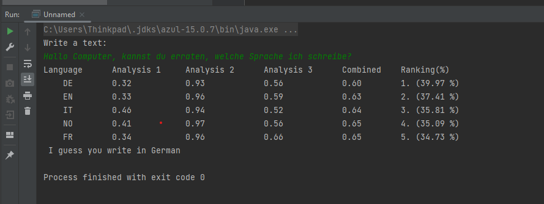

# Java language analyzer program

## Description of Java language analyzer program:
A Java program that allows the user to enter a text and then the program analyzes (guesses) in which language the user wrote.

## Here is the program run test:

### PART 1 Analysis 1:
- In the project's repo under assets / lang-samples, there are files with language examples in eight different languages, these are intended to be used as a basis for the analysis - with the help of statistics from these, we train our program to recognize the same language in other texts.

- Then the user to enter any text. When the user has finished entering, the program must guess which language the user has written their text in. This is done by applying the same algorithm to the user's input text and then comparing the percentage character distribution of the input text with the percentage character distribution of all languages based on the text files.

### PART 2 Analysis 2:
- The same program as in Analysis 1 but in addition an algorithm that analyzes the percentage distribution of characters in combination of three for each language.

### PART 3 Analysis 3:
- Thet same program as in PART 1 and PART 2 but in addition an algorithm that considers the first character of each word in the text and calculates the percentage distribution.

### PART 4 Combined:
- Combine the above analysis methods (character distribution, 3-character distribution, distribution of 1st characters) where the different analysis methods are weighted against each other. Which calculates the difference in the character distribution between the entered text and the text files for each analysis method separately and then you combine these differences, for example by calculating the average.

- The language with the lowest difference in average in relation to the entered text becomes the program's "language guess".

### PART 5 - Good object-oriented design

- Structuring the programs so that the logic is divided into classes according to function - each class must have a clear task. In the program code, code repetitions are also avoided.

- The code is with consistent syntax, correct indents and comments.